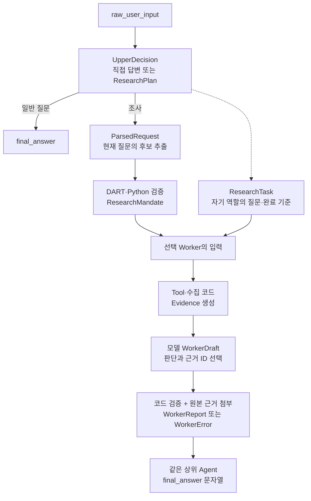

# 현재 스키마 — stock_agent

> 2026-09-18 v2 조사 계약 반영. 현재 코드의 입출력과 실행 경계를 설명한다.

## 모델 연결 설정

`backend/model_settings.py`의 `ProviderSelection`은 `provider` 한 필드이며 `openai`, `openrouter`, `openai_codex`를 허용한다. API 키·모델 ID 변경은 받지 않는다.

설정 조회/전환 응답:

| 필드 | 계약 |
| --- | --- |
| provider | 위 세 공급자 또는 미설정·잘못된 설정이면 null |
| auth_mode | api_key / subscription / null |
| models | planner, parser, worker, summary별 최종 모델 ID. 공급자 미설정이면 빈 객체 |
| reasoning_efforts | 같은 네 역할의 추론 깊이 또는 null(기본값). API Key 방식은 null |
| codex_model_options | 앱이 허용하는 모델 ID → 추론 깊이 배열. 계정 접근 권한 목록은 아님 |
| busy | Chat·Research·포트폴리오 진단 실행 중 여부 |
| api_keys | openai, openrouter 키 존재 여부 boolean. 키 값 제외 |
| codex | state(signed_out/signed_in/expired/error), message. 저장된 인증의 로컬 상태 |
| login | 아래 로그인 상태 또는 null |

로그인 상태는 `id`(UUID), `state`(pending/completed/expired/error), `message`, `user_code`(pending일 때만 문자열, 그 외 null), `verification_url`(고정 OpenAI 기기 로그인 주소), `interval`(조회 간격 초), `expires_in`(남은 초)다. 서버의 `LoginSession`에 있는 인증 객체·기기 인증 ID·토큰은 직렬화하지 않는다. 대기 세션은 메모리, 완료한 인증은 프로젝트 전용 파일에 저장한다.

`PUT /api/settings/codex/models`의 `CodexRoleSettings`는 planner, parser, worker, summary 네 필드를 모두 요구한다. 각 값은 `{model, reasoning_effort}`다. model은 gpt-6-astra 또는 gpt-5.6-sol/terra/luna이며 reasoning_effort는 null·none·low·medium·high·xhigh·max다. Astra의 none, 모르는 모델/단계, 추가 필드, 누락 역할은 422다. 추론 기본값은 null이며 누락해도 null로 처리한다.

SSE `run.started`는 `run_id` 외에 `connection: {provider, auth_mode, models, reasoning_efforts, busy}`를 포함한다. 요청의 선택 설정이며 실제 인증 성공 기록은 아니다. 대화 DB에는 저장하지 않는다.

## Chat

### 대화 저장 — 구현

로컬 SQLite `data/chat.sqlite3`에 다음 테이블을 사용한다. 시각은 UTC ISO 문자열이며
대화는 `user_id=local`로 분리한다. 로그인/다중 사용자 인증은 미구현이다.

| 테이블 | 필드 |
| --- | --- |
| conversations | id(UUID), user_id, title, created_at, updated_at, summary, last_summarized_message_id |
| messages | id(정수), conversation_id(FK), role(user/assistant), content, status, created_at |

status는 pending/completed/error/interrupted다. 질문은 completed로, 답변은 pending으로
같은 트랜잭션에 삽입한다. 메시지 ID 순서로 복원하며 최종 응답 시 답변 행을 갱신한다.
대화의 updated_at은 마지막 질문 시각이다. 첫 질문의 공백을 정리한 최대 40자로 제목을 정한다.
대화 삭제는 메시지에 CASCADE된다. 실행 그래프·포트폴리오 상세 표·장기 선호는 저장하지 않는다.

`ChatRequest`는 message(1~300자)와 선택적 conversation_id(UUID)를 받는다.
ID를 생략하면 대화 저장·단기 맥락 없이 실행하며 로컬 장기 기억은 공유한다. ID가 있으면 요약과 최근 완료된 10턴을 상위 Agent 입력에 포함한다.

`summary`는 기본 빈 문자열인 TEXT, `last_summarized_message_id`는 기본 null인 INTEGER다.
서버 시작 시 기존 DB에 누락된 두 컬럼만 추가한다. 경계는 마지막으로 요약한 완료 턴의 assistant 메시지 ID다.
요약과 경계는 함께 갱신하며 원문은 남긴다. API 대화 객체에도 두 필드가 포함된다.

`backend/short_term_memory.py`의 `SessionSummary`는 goal, constraints, active_state,
resolved_questions의 네 문자열을 요구한다. 공백만 있는 값은 거부하고 검증 후 Markdown으로 변환한다.

### 상위 Agent 결정

`agents/orchestrator.py`의 `UpperDecision`은 `intent`, `final_answer`, `research_plan`을 가진다.

- general: 비어 있지 않은 final_answer, research_plan은 null.
- research: ResearchPlan 필수, final_answer는 null.
- 조사 이후 같은 상위 Agent가 final_answer를 반환하면 종료한다. Router의 intent-only 계약과 별도 ChatState는 제거했다.
- `short_term_summary`는 요약 문자열, `recent_messages`는 역할·내용 튜플 목록(최대 20개 메시지)이다. 현재 질문은 포함하지 않는다.

### 장기 메모리 Tool

`memory_enabled`는 서버가 로컬 Chat에서만 true로 설정한다. 클라이언트 요청 필드가 아니다.
`update_memory` 입력: action(add/replace/remove), content(추가·교체 시 필수), old_text(교체·삭제 시 필수).
성공은 success=true, action, changed, message를 반환한다. 실패는 success=false와 message,
호출 한도 도달 시 done=true를 추가한다. 파일은 `memory/local/USER.md`이며 항목 구분자는 `\n§\n`이다.
새 API·DB 컬럼은 추가하지 않는다.

## 종목 조사 · v2

`src/stock_agent/state.py`의 실제 모델과 `agents/worker.py`의 실행 검증 기준이다. 상위 Agent의 첫 판단이 파싱보다 앞선다.

### ParsedRequest — 모델이 추출한 후보

| 필드 | 의미 |
| --- | --- |
| `company_candidates` | 회사명 후보 목록. 기본 빈 목록 |
| `research_question` | 회사·날짜 표현을 정리한 조사 질문 |
| `as_of_date` | 기준일 후보. 미지정은 `null` |
| `period_days` | 자료 조회 기간 후보. 미지정은 `null` |
| `investment_horizon` | 사용자가 밝힌 투자 기간 문자열. 자료 조회 기간과 구분, 없으면 `null` |
| `needs_clarification` | 모호한 대상·복수 종목 등 확인 필요 여부 |
| `clarification_reason` | 확인이 필요한 이유. 없으면 `null` |

Pydantic 출력 형식 검증 이후 Python에서 모호함 → 회사 후보 → 기준일 → 기간 → 빈 질문 → DART 회사 코드 순서로 검증한다. 기준일 기본값은 KST 오늘, 조회 기간 기본값은 `None`일 때만 30일이다. 0·음수·3650일 초과는 거부하며 미래 기준일도 거부한다. 상대 날짜·별칭·질문 의미의 추출 정확성은 모델 판단이다.

### ResearchPlan · ResearchTask — 조사할 내용

| 필드 | 의미 |
| --- | --- |
| `ResearchPlan.planning_summary` | 역할 선택과 조사 방향 설명 |
| `ResearchPlan.tasks` | 하나 이상의 역할별 작업 |
| `ResearchTask.agent` | `business`, `macro_sector`, `event_catalyst`, `technical`, `sentiment` 중 하나 |
| `ResearchTask.objective` | 해당 역할의 조사 목표 |
| `ResearchTask.questions` | 답할 질문 목록. 최소 1개 |
| `ResearchTask.completion_criteria` | 조사에서 확인할 내용. 최소 1개 |

`_normalize_plan()`이 같은 역할의 작업을 병합하고 첫 목표를 유지한다. 질문·완료 기준의 중복을 제거해 각각 최대 4개로 제한하며 역할 순서를 고정한다. 완료 기준의 의미적 충족 여부를 독립 판정하는 코드는 없다.

### ResearchMandate — 검증된 공통 조사 조건

| 필드 | 의미 |
| --- | --- |
| `original_question` | Parser가 받은 현재 사용자 원문 |
| `research_question` | 검증한 조사 질문 |
| `ticker` | 국내 종목 코드 |
| `corp_name` | 확인된 회사명 |
| `corp_code` | DART 회사 식별자 |
| `as_of_date` | 분석 기준일 `YYYY-MM-DD` |
| `period_days` | 자료 조회 달력일 수, 1~3650 |
| `query_start_date` | `as_of_date − (period_days − 1)`로 계산한 조회 시작일 |
| `query_end_date` | 조회 종료일. 현재는 `as_of_date`와 동일 |
| `investment_horizon` | 투자 기간 맥락. 조회 기간으로 자동 변환하지 않는 값 |
| `purpose` | 근거 기반 조사·투자 판단 지원이라는 목적 |
| `constraints` | 사실·해석·시점·자동 주문 제외에 관한 공통 지침 |

시작일과 종료일은 모두 포함한다. `ResearchMandate`는 TypedDict이며 그 자체의 런타임 검증 기능은 없고 Parser 검증 코드와 Tool 생성·호출 경계에서 확인한다. 재무·기술 지표의 계산에 필요한 과거 자료 범위는 사건 조회 기간과 별개다.

### Evidence — 코드가 확보한 원문·수치·댓글

| 필드 | 의미 |
| --- | --- |
| `evidence_id` | 수집·계산 코드가 부여한 비어 있지 않은 근거 ID |
| `kind` | `excerpt`, `metric`, `comment` |
| `content` | 원문 문자열 또는 수치·산식 등이 담긴 객체 |
| `source` | 제공처·URL·공시 위치·댓글 ID 등 자료별 출처 객체 |
| `published_at` | 공개·작성 시각. 확인되지 않으면 `null` |
| `observation_start` | 관측·계산 기간의 시작. 없으면 `null` |
| `observation_end` | 관측·계산 기간의 종료. 없으면 `null` |
| `retrieved_at` | 수집 시각 |
| `limitations` | 절단·가격 조정·시점 확인 등 근거별 한계 |

`EvidenceLedger`는 수집 근거의 날짜·중복 ID·입력 크기를 검사하고 원본을 보존한다. 공개일이 기준일보다 늦으면 제외한다. 공개일 없는 자료는 관측 종료일이 있는 `metric`만 허용하며 관측 종료일도 기준일 이하여야 한다. ID가 같으면서 내용이 다르면 오류다.

Business는 최대 24개, 다른 일반 Worker는 12개, Sentiment는 40개를 보관한다. 문자열은 항목당 4,000자, 댓글은 600자로 자르고 한계를 표시한다. 4,000자를 넘는 구조화 객체는 잘라서 깨진 수치로 만들지 않고 항목 전체를 제외한다. 이 날짜 검사는 수정된 원문의 과거 버전이나 가격 조정의 과거 재현을 보장하지 않는다.

### WorkerDraft → WorkerReport — 모델 판단과 원본 근거 결합

모델은 `WorkerDraft`만 작성한다. `Evidence`·역할은 코드가 부착하므로 모델이 출처 본문을 새로 작성하는 출력 필드는 없다.

| 필드 | 의미 |
| --- | --- |
| `WorkerDraft.status` | `complete`, `partial`, `unavailable` |
| `WorkerDraft.findings` | 질문별 사실·해석 목록 |
| `WorkerDraft.unanswered_questions` | 답하지 못했거나 일부만 답한 질문과 이유 |
| `WorkerDraft.limitations` | 모델이 설명한 판단의 한계 |
| `Finding.question_index` | 자기 `questions` 목록에서 0부터 시작한 질문 번호 |
| `Finding.statement` | 비어 있지 않은 주장 |
| `Finding.kind` | `fact` 또는 `inference` |
| `Finding.evidence_ids` | 실제 받은 근거 ID 하나 이상 |
| `UnansweredQuestion.question_index` | 미확인 질문 번호 |
| `UnansweredQuestion.reason` | 비어 있지 않은 미확인 사유 |
| `WorkerReport.agent` | 실행 코드가 확정한 역할 |
| `WorkerReport.evidence` | 주장이 실제 참조한 원본 Evidence만 포함한 목록 |

`WorkerDraft`, `Finding`, `UnansweredQuestion`은 추가 필드를 거부한다. `finish_report()`는 질문 번호가 배정 범위를 벗어나거나 누락되지 않았는지, 인용 ID가 실제 확보한 ID인지 검사한다. 부분 답변 질문은 `findings`와 `unanswered_questions` 양쪽에 나타날 수 있다. 코드가 수집한 한계와 Tool 실패 이유도 보고서에 합친다.

| 상태 | 의미 |
| --- | --- |
| `complete` | 답변이 있고 미확인 질문 없음 |
| `partial` | 답변과 미확인 질문이 모두 존재 |
| `unavailable` | 답변 없이 미확인 질문만 존재 |

근거를 하나도 얻지 못했고 실행 오류도 없으면 코드가 모든 질문을 미확인으로 한 `unavailable` 보고서를 생성한다. ID·형식 검증은 주장의 금융적 정확성이나 원문이 주장을 충분히 지지하는지에 대한 의미 검증과 별개다.

### WorkerError — 정상적인 자료 부족과 다른 실행 실패

| 필드 | 의미 |
| --- | --- |
| `agent` | 실패한 역할 |
| `status` | 고정값 `error` |
| `code` | 시간 초과·출력 형식·통신 등 오류 종류 |
| `message` | 실패 원인 안내 |
| `retryable` | 재실행 가능성 정보. 자동 재시도 실행을 의미하지 않음 |

근거 없이 Tool 오류만 남거나 유효한 보고서를 만들 수 없으면 `WorkerError`를 반환한다. 다른 Worker는 계속 처리하고 상위 Agent에 성공 보고서와 오류를 함께 전달한다. 사용자 취소는 오류 보고서로 바꾸지 않고 호출자로 전파한다.

### StockAgentState — 단계별 결과의 저장 위치

| 필드 | 의미 |
| --- | --- |
| `raw_user_input` | 현재 질문 |
| `run_id` | 요청 실행 식별자 |
| `research_only` | 직접 답변 대신 조사 계획을 요구하는 내부 옵션 |
| `memory_enabled` | 로컬 Chat의 상위 Agent 기억 사용 여부 |
| `short_term_summary` | 상위 Agent에 제공할 세션 요약 |
| `recent_messages` | 상위 Agent에 제공할 최근 완료된 대화 |
| `intent` | `general` 또는 `research` |
| `research_plan` | 상위 Agent의 조사 계획 |
| `parsed_request` | Parser 추출 후보 |
| `input_error` | 입력 검증 실패 안내 |
| `research_mandate` | 검증된 공통 조사 조건 |
| `business_report` | Business의 `WorkerReport` 또는 `WorkerError` |
| `macro_sector_report` | Macro의 `WorkerReport` 또는 `WorkerError` |
| `event_catalyst_report` | Event의 `WorkerReport` 또는 `WorkerError` |
| `technical_report` | Technical의 `WorkerReport` 또는 `WorkerError` |
| `sentiment_report` | Sentiment의 `WorkerReport` 또는 `WorkerError` |
| `final_answer` | 상위 Agent가 작성한 최종 Markdown 문자열 |

공유 State는 TypedDict이며 Worker별 별도 필드로 병합한다. 모델 입력은 `worker_input()`이 고른 자기 작업과 공통 조사 조건뿐이다. 조사 하위 그래프에는 장기 기억 사용 옵션·최근 대화·요약을 넘기지 않는다. 선택되지 않은 Worker의 결과 필드는 생성하지 않는다. HTTP·SSE의 직렬화는 [API 문서](api.md)의 v2 Worker 결과 계약을 따른다.

## 포트폴리오

`src/stock_agent/portfolio/schemas.py`에 독립 정의한다.

| 타입 | 계약 |
| --- | --- |
| Holding | symbol, name, amount, purchase_amount. 두 금액은 필수·유한·0 이상 Decimal |
| SectorAssignments | items: symbol, sector, reason. reason은 1~300자 |
| Sector | 정보기술, 커뮤니케이션, 경기소비재, 필수소비재, 금융, 산업재, 소재, 에너지, 헬스케어, 유틸리티, 부동산, 미분류 |
| PortfolioExplanation | summary 1~2000자, observations 최대 5개, limitations 1~5개 |

입력 종목과 업종 분류 결과의 정확한 집합 일치·중복 검사는 계산 코드가 수행한다. 업종의 금융적 정확성 검사는 아니다.

금액·백분율은 Decimal 계산 후 문자열로 반환한다. 매입금액 0일 때 평가손익률은 null이다. fetched_at은 앱 수집 시각이며 원천 평가 시각을 보장하지 않는다. HTTP 입출력은 [API 문서](api.md)를 따른다.

## 평가 데이터 계약 (v0.2, 구현)

- Parsing 사례는 `today`, 명시적 기대 날짜, `origin`, `label_rationale`을 가진다.
- 정상 정답과 오류 정답 중 하나만 지정한다. 오류 사례의 `expected_error_pattern`은 문구 기반 채점이며 제품 오류 Enum이 아니다.
- Routing 사례는 고정 `as_of_date`·`period_days`와 `expected_agents`·정답 이유를 가진다.
- 기존 E2E 사례의 `evaluation_status=pending`, Grounding 사례의 `evaluation_status=reference_ready`는 자동 실행·채점 대상이 아니다.
- Grounding의 `fixture`는 `evals/fixtures/`의 근거 파일을 참조하고, `expected_facts`는 지표명·값·단위·절대 허용 오차를 가진다.
- 실행 결과는 실제 모델 설정·버전 해시·미평가 항목과 사례별 반복 집계를 저장한다. 제품 API·공유 State 스키마는 이번 평가 변경으로 바뀌지 않았다.

## 공시 근거 검색 · 2026-09-17 파일럿 당시 계약

아래는 v2 Worker 통합 이전의 역사적 계약이다. 현재 `search_disclosure_evidence`는 위의 공통 Evidence·보고서 계약을 사용하며 이 상태 이름은 현행 Worker 결과와 다르다. 당시 공개 API/StockAgentState 변경은 없었다. `search_evidence`는 질문, 고정 회사 코드·기준일, 선택 접수번호·목차 힌트를 받으며 `chunk_id`, `block_id`, `parent_id`, `member`, `source_line`, `section`, `kind`, `range`, `text`, `search_text`, `receipt_id`, `published_date`, `source_url`, `context`, `context_truncated`, BM25/벡터 순위와 RRF 점수를 반환한다. `range`는 본문은 문자 오프셋(끝 제외), 표는 원문 표의 행 범위(1부터, 끝 포함)다.

Tool factory는 `retrieved`, `no_indexed_evidence`, `budget_exhausted`, `error` 상태를 JSON 문자열로 반환한다. `retrieved`는 관련 후보가 있다는 뜻이며 사실 정확성·조사 완료 판정이 아니다. [상세 검증](disclosure-rag-pilot.md).
